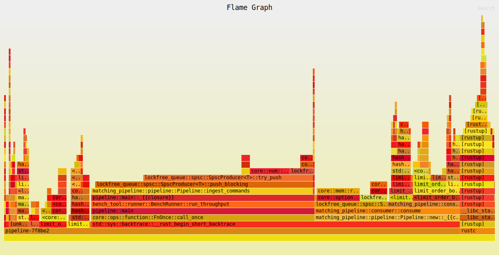

# Matching pipeline

| Property | Value |
|----------|-------|
| Timestamp | 2026-03-24T08:58:31Z |
| CPU | AMD Ryzen 7 7800X3D 8-Core Processor |
| Cores | 16 |
| Memory | 30.5 GB |
| OS | Linux Mint 22.3 (x86_64) |
| Host | mint |
| Rust | rustc 1.91.1 (ed61e7d7e 2025-11-07) |
| Clock | TSC (RDTSC via quanta) |

## 

| Property | Value |
|----------|-------|
| queue_slots | 4096 |
| sample | LOBSTER_SampleFiles/GOOG_2012-06-21_34200000_57600000_message_1.csv |

### Throughput

| Scenario | ops/sec | allocs/op | deallocs/op | bytes/op | setup allocs | setup bytes |
|----------|---------|-----------|-------------|----------|--------------|-------------|
| Pipeline (Lobster data) | 14375647 | 0.2 | 0.0 | 0B | 10 | 21.8MiB |

| Scenario | Accepted | Rejected | Fill | Filled | Cancelled |
|----------|----------|----------|------|--------|-----------|
| Pipeline (Lobster data) | 961579 | 224768 | 620090 | 633464 | 325533 |

##### Throughput flamegraph

