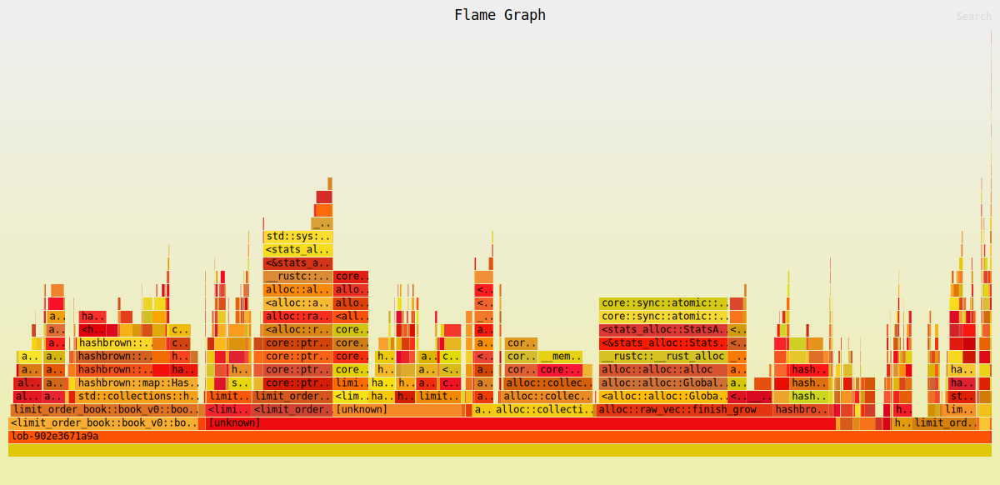

# Limit Order Book (v0)

| Property | Value |
|----------|-------|
| Timestamp | 2026-03-24T08:47:59Z |
| CPU | AMD Ryzen 7 7800X3D 8-Core Processor |
| Cores | 16 |
| Memory | 30.5 GB |
| OS | Linux Mint 22.3 (x86_64) |
| Host | mint |
| Rust | rustc 1.91.1 (ed61e7d7e 2025-11-07) |
| Clock | TSC (RDTSC via quanta) |

## Latency

| Property | Value |
|----------|-------|
| BENCH_ITERS | 100000 |
| WARMUP_ITERS | 10000 |
| book_levels | 100 |
| orders_per_level | 10 |

### Latency

| Operation | min | p50 | p90 | p95 | p99 | p99.9 | max | mean | stdev | allocs/op | deallocs/op | bytes/op |
|-----------|-----|-----|-----|-----|-----|-------|-----|------|-------|-----------|-------------|----------|
| Add (passive) | 30ns | 40ns | 50ns | 60ns | 70ns | 120ns | 4.2μs | 43ns | 19ns | 1.0 | 0.0 | 32B |
| Add (sweep 5 levels, 50 fills) | 1.1μs | 1.2μs | 1.2μs | 1.3μs | 1.5μs | 4.2μs | 23.6μs | 1.2μs | 277ns | 0.0 | 6.0 | 0B |
| Market (sweep 10 levels, 100 fills) | 2.2μs | 2.4μs | 2.4μs | 2.5μs | 3.0μs | 6.4μs | 158.7μs | 2.4μs | 660ns | 0.0 | 14.0 | 0B |
| Cancel (head of queue) | 20ns | 40ns | 40ns | 50ns | 60ns | 310ns | 8.4μs | 37ns | 36ns | 0.0 | 0.0 | 0B |
| Cancel (tail of queue) | 130ns | 150ns | 160ns | 160ns | 170ns | 230ns | 3.5μs | 150ns | 34ns | 0.0 | 0.0 | 0B |
| Spread (BBO query) | 1ns | 10ns | 10ns | 20ns | 20ns | 90ns | 2.8μs | 9ns | 10ns | 0.0 | 0.0 | 0B |
| Depth (top 5) | 10ns | 40ns | 50ns | 50ns | 60ns | 370ns | 19.9μs | 40ns | 92ns | 1.0 | 1.0 | 80B |
| Order lookup (hit) | 1ns | 10ns | 20ns | 20ns | 30ns | 190ns | 621ns | 14ns | 11ns | 0.0 | 0.0 | 0B |
| Realistic mix (per-op) | 1ns | 50ns | 70ns | 80ns | 90ns | 320ns | 20.3μs | 53ns | 74ns | 0.4 | 0.0 | 13B |

## Throughput (realistic mix)

| Property | Value |
|----------|-------|
| book_levels | 100 |
| orders_per_level | 10 |

### Throughput

| Scenario | ops/sec | allocs/op | deallocs/op | bytes/op | setup allocs | setup bytes |
|----------|---------|-----------|-------------|----------|--------------|-------------|
| Throughput (realistic mix) | 27559173 | 38.0 | 35.0 | 3.3KiB | 645 | 499.6KiB |

| Scenario | Accepted | Rejected | Fill | Filled | Cancelled |
|----------|----------|----------|------|--------|-----------|
| Throughput (realistic mix) | 116000000 | 0 | 32000000 | 40000000 | 76000000 |

##### Throughput flamegraph

