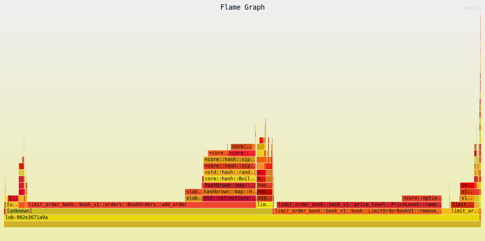

# Limit Order Book (v1)

| Property | Value |
|----------|-------|
| Timestamp | 2026-03-24T08:51:13Z |
| CPU | AMD Ryzen 7 7800X3D 8-Core Processor |
| Cores | 16 |
| Memory | 30.5 GB |
| OS | Linux Mint 22.3 (x86_64) |
| Host | mint |
| Rust | rustc 1.91.1 (ed61e7d7e 2025-11-07) |
| Clock | TSC (RDTSC via quanta) |
| Baseline | "Limit Order Book (v0)" (2026-03-24T08:47:59Z) |

## Latency

| Property | Value |
|----------|-------|
| BENCH_ITERS | 100000 |
| WARMUP_ITERS | 10000 |
| book_levels | 100 |
| orders_per_level | 10 |

### Latency

| Operation | min | p50 | p90 | p95 | p99 | p99.9 | max | mean | stdev | allocs/op | deallocs/op | bytes/op |
|-----------|-----|-----|-----|-----|-----|-------|-----|------|-------|-----------|-------------|----------|
| Add (passive) | 20ns | 40ns | 40ns | 40ns | 50ns | 340ns | 17.6μs | 38ns | 66ns | 0.0 | 0.0 | 0B |
| Add (sweep 5 levels, 50 fills) | 651ns | 701ns | 741ns | 761ns | 831ns | 2.0μs | 24.0μs | 714ns | 164ns | 0.0 | 0.0 | 0B |
| Market (sweep 10 levels, 100 fills) | 1.3μs | 1.4μs | 1.4μs | 1.5μs | 1.7μs | 4.6μs | 24.2μs | 1.4μs | 246ns | 0.0 | 0.0 | 0B |
| Cancel (head of queue) | 30ns | 40ns | 50ns | 50ns | 70ns | 340ns | 2.9μs | 41ns | 20ns | 0.0 | 0.0 | 0B |
| Cancel (tail of queue) | 20ns | 30ns | 30ns | 40ns | 50ns | 350ns | 4.8μs | 29ns | 31ns | 0.0 | 0.0 | 0B |
| Spread (BBO query) | 1ns | 10ns | 10ns | 10ns | 10ns | 50ns | 3.2μs | 7ns | 14ns | 0.0 | 0.0 | 0B |
| Depth (top 5) | 100ns | 130ns | 140ns | 150ns | 220ns | 1.2μs | 23.7μs | 139ns | 146ns | 2.0 | 1.0 | 128B |
| Order lookup (hit) | 1ns | 10ns | 20ns | 20ns | 20ns | 100ns | 3.3μs | 11ns | 18ns | 0.0 | 0.0 | 0B |
| Realistic mix (per-op) | 1ns | 50ns | 70ns | 70ns | 90ns | 400ns | 16.0μs | 53ns | 71ns | 0.0 | 0.0 | 0B |

#### vs baseline

| Operation | p50 | p99 | p99.9 | mean | allocs/op | deallocs/op | bytes/op |
|-----------|-----|-----|-------|------|-----------|-------------|----------|
| Add (passive) | 40ns (=) | 50ns (↓28.6%) | 340ns (↑183.3%) | 38ns (↓9.8%) | 0.0 (↓100.0%) | 0.0 (=) | 0B (↓100.0%) |
| Add (sweep 5 levels, 50 fills) | 701ns (↓41.2%) | 831ns (↓45.4%) | 2.0μs (↓52.8%) | 714ns (↓41.0%) | 0.0 (=) | 0.0 (↓100.0%) | 0B (=) |
| Market (sweep 10 levels, 100 fills) | 1.4μs (↓41.7%) | 1.7μs (↓41.7%) | 4.6μs (↓28.4%) | 1.4μs (↓41.7%) | 0.0 (=) | 0.0 (↓100.0%) | 0B (=) |
| Cancel (head of queue) | 40ns (=) | 70ns (↑16.7%) | 340ns (↑9.7%) | 41ns (↑10.8%) | 0.0 (=) | 0.0 (=) | 0B (=) |
| Cancel (tail of queue) | 30ns (↓80.0%) | 50ns (↓70.6%) | 350ns (↑52.2%) | 29ns (↓80.1%) | 0.0 (=) | 0.0 (=) | 0B (=) |
| Spread (BBO query) | 10ns (=) | 10ns (↓50.0%) | 50ns (↓44.4%) | 7ns (↓14.7%) | 0.0 (=) | 0.0 (=) | 0B (=) |
| Depth (top 5) | 130ns (↑225.0%) | 220ns (↑266.7%) | 1.2μs (↑216.8%) | 139ns (↑242.3%) | 2.0 (↑100.0%) | 1.0 (=) | 128B (↑60.0%) |
| Order lookup (hit) | 10ns (=) | 20ns (↓33.3%) | 100ns (↓47.4%) | 11ns (↓20.1%) | 0.0 (=) | 0.0 (=) | 0B (=) |
| Realistic mix (per-op) | 50ns (=) | 90ns (=) | 400ns (↑25.0%) | 53ns (=) | 0.0 (↓100.0%) | 0.0 (=) | 0B (↓100.0%) |

## Throughput (realistic mix)

| Property | Value |
|----------|-------|
| book_levels | 100 |
| orders_per_level | 10 |

### Throughput

| Scenario | ops/sec | allocs/op | deallocs/op | bytes/op | setup allocs | setup bytes |
|----------|---------|-----------|-------------|----------|--------------|-------------|
| Throughput (realistic mix) | 51888038 | 0.0 | 0.0 | 0B | 3 | 1.9MiB |

#### vs baseline

| Operation | ops/sec | allocs/op | deallocs/op | bytes/op | setup allocs | setup bytes |
|-----------|---------|-----------|-------------|----------|--------------|-------------|
| Throughput (realistic mix) | 51.9M (↑88.3%) | 0.0 (↓100.0%) | 0.0 (↓100.0%) | 0B (↓100.0%) | 3.0 (↓99.5%) | 1.9MiB (↑298.5%) |

| Scenario | Accepted | Rejected | Fill | Filled | Cancelled |
|----------|----------|----------|------|--------|-----------|
| Throughput (realistic mix) | 116000000 | 0 | 32000000 | 40000000 | 76000000 |

##### Throughput flamegraph

