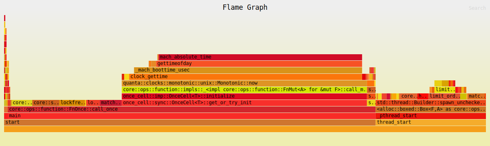

# Matching pipeline

| Property | Value |
|----------|-------|
| Timestamp | 2026-03-24T12:07:27Z |
| CPU | Apple M4 Pro |
| Cores | 12 |
| Memory | 24.0 GB |
| OS | Darwin 15.7.4 (aarch64) |
| Host | Mac.mynet |
| Rust | rustc 1.91.1 (ed61e7d7e 2025-11-07) |
| Clock | OS clock (platform fallback via quanta) |
| ASLR | sysctl failed (status exit status: 1): sysctl: unknown oid 'kern.randomize_va_space' |
| CPU governor | not exposed via sysfs (macOS; see `pmset -g` / Energy settings) |
| IRQ affinity (sample) | not applicable (macOS) |
| Isolated CPUs | not applicable (macOS; no isolcpus sysfs — use thread affinity / QoS) |
| Swap | total = 6144.00M  used = 5250.19M  free = 893.81M  (encrypted) |
| Turbo / boost | not exposed via sysfs (macOS) |

## Pipeline

| Property | Value |
|----------|-------|
| consumer_pin_core | Could not pin core 3 |
| producer_pin_core | Could not pin core 2 |
| queue_slots | 4096 |
| sample | LOBSTER_SampleFiles/GOOG_2012-06-21_34200000_57600000_message_1.csv |

### Throughput

| Scenario | ops/sec | allocs/op | deallocs/op | bytes/op | setup allocs | setup bytes |
|----------|---------|-----------|-------------|----------|--------------|-------------|
| Pipeline (Lobster data) | 18.6M | 0.3 | 0.0 | 2B | 11 | 21.8MiB |

| Scenario | Accepted | Rejected | Fill | Filled | Cancelled |
|----------|----------|----------|------|--------|-----------|
| Pipeline (Lobster data) | 961.6k | 224.8k | 620.1k | 633.5k | 325.5k |

##### Throughput flamegraph

