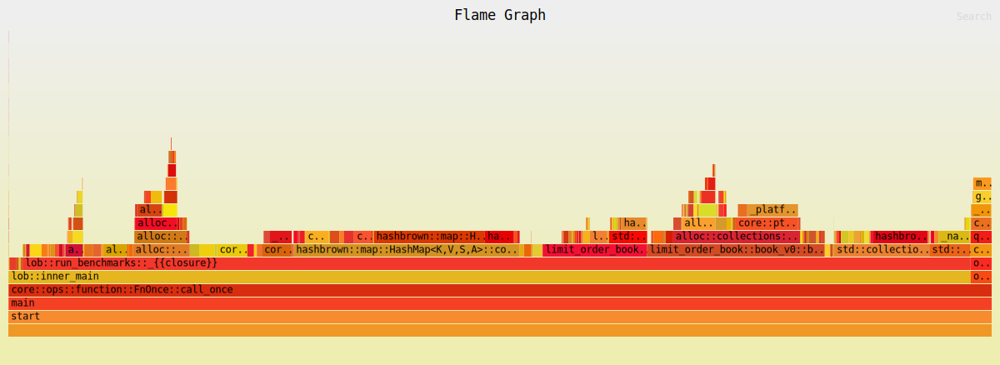

# Limit Order Book (v0)

| Property | Value |
|----------|-------|
| Timestamp | 2026-03-24T12:04:19Z |
| CPU | Apple M4 Pro |
| Cores | 12 |
| Memory | 24.0 GB |
| OS | Darwin 15.7.4 (aarch64) |
| Host | Mac.mynet |
| Rust | rustc 1.91.1 (ed61e7d7e 2025-11-07) |
| Clock | OS clock (platform fallback via quanta) |
| ASLR | sysctl failed (status exit status: 1): sysctl: unknown oid 'kern.randomize_va_space' |
| CPU governor | not exposed via sysfs (macOS; see `pmset -g` / Energy settings) |
| IRQ affinity (sample) | not applicable (macOS) |
| Isolated CPUs | not applicable (macOS; no isolcpus sysfs — use thread affinity / QoS) |
| Swap | total = 6144.00M  used = 5250.19M  free = 893.81M  (encrypted) |
| Turbo / boost | not exposed via sysfs (macOS) |

## Latency

| Property | Value |
|----------|-------|
| BENCH_ITERS | 100000 |
| Default pinned core | Could not pin core 2 |
| WARMUP_ITERS | 10000 |
| book_levels | 100 |
| orders_per_level | 10 |

### Latency

| Operation | min | p50 | p90 | p99 | p99.9 | max | mean | stdev | allocs/op | deallocs/op | bytes/op |
|-----------|-----|-----|-----|-----|-------|-----|------|-------|-----------|-------------|----------|
| Add (passive) | 1ns | 42ns | 42ns | 84ns | 125ns | 6.4μs | 39ns | 30ns | 1.0 | 0.0 | 32B |
| Add (sweep 5 levels, 50 fills) | 875ns | 1.1μs | 1.2μs | 1.5μs | 4.9μs | 40.5μs | 1.1μs | 337ns | 0.0 | 6.0 | 0B |
| Market (sweep 10 levels, 100 fills) | 1.8μs | 2.2μs | 2.4μs | 3.0μs | 9.4μs | 98.7μs | 2.3μs | 640ns | 0.0 | 14.0 | 0B |
| Cancel (head of queue) | 1ns | 41ns | 42ns | 83ns | 292ns | 18.9μs | 32ns | 65ns | 0.0 | 0.0 | 0B |
| Cancel (tail of queue) | 100ns | 167ns | 208ns | 227ns | 500ns | 19.4μs | 168ns | 120ns | 0.0 | 0.0 | 0B |
| Spread (BBO query) | 1ns | 1ns | 1ns | 42ns | 42ns | 167ns | 3ns | 9ns | 0.0 | 0.0 | 0B |
| Depth (top 5) | 1ns | 42ns | 83ns | 84ns | 84ns | 129.4μs | 45ns | 411ns | 1.0 | 1.0 | 80B |
| Order lookup (hit) | 1ns | 1ns | 1ns | 42ns | 42ns | 292ns | 4ns | 11ns | 0.0 | 0.0 | 0B |
| Realistic mix (per-op) | 1ns | 42ns | 83ns | 84ns | 125ns | 8.9μs | 45ns | 44ns | 0.4 | 0.0 | 13B |

## Throughput (realistic mix)

| Property | Value |
|----------|-------|
| Default pinned core | Could not pin core 2 |
| book_levels | 100 |
| orders_per_level | 10 |

### Throughput

| Scenario | ops/sec | allocs/op | deallocs/op | bytes/op | setup allocs | setup bytes |
|----------|---------|-----------|-------------|----------|--------------|-------------|
| Throughput (realistic mix) | 28.8M | 38.0 | 35.0 | 3.3KiB | 645 | 499.5KiB |

| Scenario | Accepted | Rejected | Fill | Filled | Cancelled |
|----------|----------|----------|------|--------|-----------|
| Throughput (realistic mix) | 116.0M | 0 | 32.0M | 40.0M | 76.0M |

##### Throughput flamegraph

