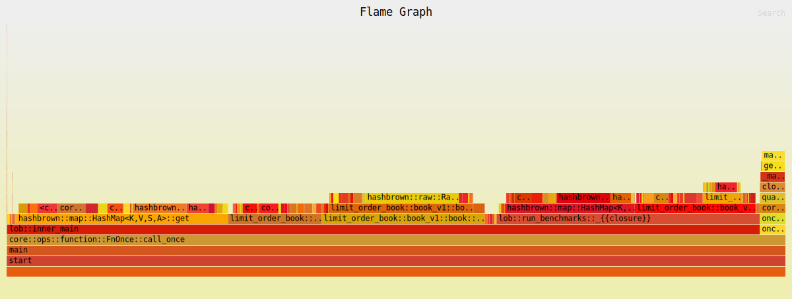

# Limit Order Book (v1)

| Property | Value |
|----------|-------|
| Timestamp | 2026-03-24T12:05:57Z |
| CPU | Apple M4 Pro |
| Cores | 12 |
| Memory | 24.0 GB |
| OS | Darwin 15.7.4 (aarch64) |
| Host | Mac.mynet |
| Rust | rustc 1.91.1 (ed61e7d7e 2025-11-07) |
| Clock | OS clock (platform fallback via quanta) |
| ASLR | sysctl failed (status exit status: 1): sysctl: unknown oid 'kern.randomize_va_space' |
| CPU governor | not exposed via sysfs (macOS; see `pmset -g` / Energy settings) |
| IRQ affinity (sample) | not applicable (macOS) |
| Isolated CPUs | not applicable (macOS; no isolcpus sysfs — use thread affinity / QoS) |
| Swap | total = 6144.00M  used = 5250.19M  free = 893.81M  (encrypted) |
| Turbo / boost | not exposed via sysfs (macOS) |
| Baseline | "Limit Order Book (v0)" (2026-03-24T12:04:19Z) |

## Latency

| Property | Value |
|----------|-------|
| BENCH_ITERS | 100000 |
| Default pinned core | Could not pin core 2 |
| WARMUP_ITERS | 10000 |
| book_levels | 100 |
| orders_per_level | 10 |

### Latency

| Operation | min | p50 | p90 | p99 | p99.9 | max | mean | stdev | allocs/op | deallocs/op | bytes/op |
|-----------|-----|-----|-----|-----|-------|-----|------|-------|-----------|-------------|----------|
| Add (passive) | 1ns | 41ns | 42ns | 42ns | 83ns | 9.7μs | 26ns | 36ns | 0.0 | 0.0 | 0B |
| Add (sweep 5 levels, 50 fills) | 392ns | 500ns | 542ns | 666ns | 709ns | 58.3μs | 503ns | 239ns | 0.0 | 0.0 | 0B |
| Market (sweep 10 levels, 100 fills) | 791ns | 958ns | 1.0μs | 1.2μs | 1.4μs | 39.6μs | 972ns | 227ns | 0.0 | 0.0 | 0B |
| Cancel (head of queue) | 1ns | 1ns | 42ns | 42ns | 84ns | 11.3μs | 12ns | 40ns | 0.0 | 0.0 | 0B |
| Cancel (tail of queue) | 1ns | 1ns | 42ns | 42ns | 42ns | 7.6μs | 13ns | 30ns | 0.0 | 0.0 | 0B |
| Spread (BBO query) | 1ns | 1ns | 1ns | 42ns | 42ns | 250ns | 2ns | 6ns | 0.0 | 0.0 | 0B |
| Depth (top 5) | 1ns | 42ns | 83ns | 125ns | 291ns | 21.4μs | 54ns | 105ns | 2.0 | 1.0 | 128B |
| Order lookup (hit) | 1ns | 1ns | 1ns | 42ns | 42ns | 3.4μs | 4ns | 15ns | 0.0 | 0.0 | 0B |
| Realistic mix (per-op) | 1ns | 41ns | 42ns | 84ns | 84ns | 3.3μs | 29ns | 27ns | 0.0 | 0.0 | 0B |

#### vs baseline

| Operation | p50 | p99 | p99.9 | mean | allocs/op | deallocs/op | bytes/op |
|-----------|-----|-----|-------|------|-----------|-------------|----------|
| Add (passive) | 41ns (↓2.4%) | 42ns (↓50.0%) | 83ns (↓33.6%) | 26ns (↓33.4%) | 0.0 (↓100.0%) | 0.0 (=) | 0B (↓100.0%) |
| Add (sweep 5 levels, 50 fills) | 500ns (↓53.9%) | 666ns (↓56.8%) | 709ns (↓85.5%) | 503ns (↓55.2%) | 0.0 (=) | 0.0 (↓100.0%) | 0B (=) |
| Market (sweep 10 levels, 100 fills) | 958ns (↓56.6%) | 1.2μs (↓58.9%) | 1.4μs (↓85.4%) | 972ns (↓56.9%) | 0.0 (=) | 0.0 (↓100.0%) | 0B (=) |
| Cancel (head of queue) | 1ns (↓97.6%) | 42ns (↓49.4%) | 84ns (↓71.2%) | 12ns (↓62.9%) | 0.0 (=) | 0.0 (=) | 0B (=) |
| Cancel (tail of queue) | 1ns (↓99.4%) | 42ns (↓81.5%) | 42ns (↓91.6%) | 13ns (↓92.1%) | 0.0 (=) | 0.0 (=) | 0B (=) |
| Spread (BBO query) | 1ns (=) | 42ns (=) | 42ns (=) | 2ns (↓36.3%) | 0.0 (=) | 0.0 (=) | 0B (=) |
| Depth (top 5) | 42ns (=) | 125ns (↑48.8%) | 291ns (↑246.4%) | 54ns (↑17.8%) | 2.0 (↑100.0%) | 1.0 (=) | 128B (↑60.0%) |
| Order lookup (hit) | 1ns (=) | 42ns (=) | 42ns (=) | 4ns (=) | 0.0 (=) | 0.0 (=) | 0B (=) |
| Realistic mix (per-op) | 41ns (↓2.4%) | 84ns (=) | 84ns (↓32.8%) | 29ns (↓35.6%) | 0.0 (↓100.0%) | 0.0 (=) | 0B (↓100.0%) |

## Throughput (realistic mix)

| Property | Value |
|----------|-------|
| Default pinned core | Could not pin core 2 |
| book_levels | 100 |
| orders_per_level | 10 |

### Throughput

| Scenario | ops/sec | allocs/op | deallocs/op | bytes/op | setup allocs | setup bytes |
|----------|---------|-----------|-------------|----------|--------------|-------------|
| Throughput (realistic mix) | 40.7M | 0.0 | 0.0 | 0B | 3 | 1.9MiB |

#### vs baseline

| Operation | ops/sec | allocs/op | deallocs/op | bytes/op | setup allocs | setup bytes |
|-----------|---------|-----------|-------------|----------|--------------|-------------|
| Throughput (realistic mix) | 40.7M (↑41.5%) | 0.0 (↓100.0%) | 0.0 (↓100.0%) | 0B (↓100.0%) | 3.0 (↓99.5%) | 1.9MiB (↑298.6%) |

| Scenario | Accepted | Rejected | Fill | Filled | Cancelled |
|----------|----------|----------|------|--------|-----------|
| Throughput (realistic mix) | 116.0M | 0 | 32.0M | 40.0M | 76.0M |

##### Throughput flamegraph

