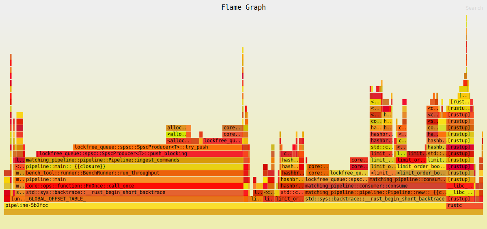

# Matching pipeline

| Property | Value |
|----------|-------|
| Timestamp | 2026-03-24T17:09:57Z |
| CPU | AMD Ryzen 7 7800X3D 8-Core Processor |
| Cores | 16 |
| Memory | 30.5 GB |
| OS | Linux Mint 22.3 (x86_64) |
| Host | mint |
| Rust | rustc 1.91.1 (ed61e7d7e 2025-11-07) |
| Clock | TSC (RDTSC via quanta) |
| ASLR | disabled (randomize_va_space=0) |
| CPU governor | performance (all 16 CPUs) |
| IRQ affinity (sample) | mixed (64 sampled IRQs; first=0-15) |
| Isolated CPUs | 2-3 |
| Swap | none active (/proc/swaps header only) |
| Turbo / boost | disabled (AMD cpufreq boost=0) |

## 

| Property | Value |
|----------|-------|
| consumer_pin_core | Could not pin core 3 |
| producer_pin_core | Could not pin core 2 |
| queue_slots | 4096 |
| sample | LOBSTER_SampleFiles/GOOG_2012-06-21_34200000_57600000_message_1.csv |

### Throughput

| Scenario | ops/sec | allocs/op | deallocs/op | bytes/op | setup allocs | setup bytes |
|----------|---------|-----------|-------------|----------|--------------|-------------|
| Pipeline (Lobster data) | 12.5M | 0.2 | 0.0 | 0B | 10 | 21.8MiB |

| Scenario | Accepted | Rejected | Fill | Filled | Cancelled |
|----------|----------|----------|------|--------|-----------|
| Pipeline (Lobster data) | 961.6k | 224.8k | 620.1k | 633.5k | 325.5k |

##### Throughput flamegraph

