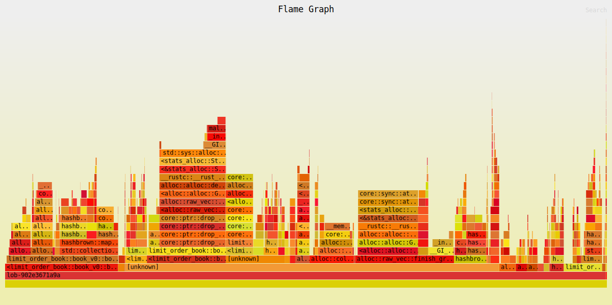

# Limit Order Book (v0)

| Property | Value |
|----------|-------|
| Timestamp | 2026-04-29T13:40:39Z |
| CPU | AMD Ryzen 7 7800X3D 8-Core Processor |
| Cores | 16 |
| Memory | 30.5 GB |
| OS | Linux Mint 22.3 (x86_64) |
| Host | bruno-linux |
| Rust | rustc 1.91.1 (ed61e7d7e 2025-11-07) |
| Clock | TSC (RDTSC via quanta) |
| ASLR | disabled (randomize_va_space=0) |
| CPU governor | performance (all 16 CPUs) |
| IRQ affinity (sample) | mixed (64 sampled IRQs; first=0-15) |
| Isolated CPUs | 2-3,10-11 |
| Swap | none active (/proc/swaps header only) |
| Turbo / boost | disabled (AMD cpufreq boost=0) |

## Latency

| Property | Value |
|----------|-------|
| book_levels | 100 |
| orders_per_level | 10 |
| BENCH_ITERS | 100000 |
| WARMUP_ITERS | 10000 |
| Default pinned core | pin core 2 |

### Latency

| Operation | min | p50 | p90 | p99 | p99.9 | max | mean | stdev | allocs/op | deallocs/op | bytes/op |
|-----------|-----|-----|-----|-----|-------|-----|------|-------|-----------|-------------|----------|
| Add (passive) | 40ns | 50ns | 60ns | 90ns | 120ns | 360ns | 51ns | 9ns | 1.0 | 0.0 | 32B |
| Add (sweep 5 levels, 50 fills) | 1.3μs | 1.5μs | 1.5μs | 1.6μs | 2.4μs | 3.1μs | 1.5μs | 76ns | 0.0 | 6.0 | 0B |
| Market (sweep 10 levels, 100 fills) | 2.7μs | 2.9μs | 3.1μs | 3.4μs | 4.1μs | 4.9μs | 2.9μs | 126ns | 0.0 | 14.0 | 0B |
| Cancel (head of queue) | 30ns | 50ns | 60ns | 80ns | 440ns | 601ns | 55ns | 25ns | 0.0 | 0.0 | 0B |
| Cancel (tail of queue) | 150ns | 160ns | 160ns | 170ns | 180ns | 280ns | 157ns | 5ns | 0.0 | 0.0 | 0B |
| Reduce (partial) | 20ns | 30ns | 40ns | 40ns | 50ns | 350ns | 33ns | 5ns | 0.0 | 0.0 | 0B |
| Spread (BBO query) | 1ns | 10ns | 10ns | 20ns | 110ns | 300ns | 9ns | 6ns | 0.0 | 0.0 | 0B |
| Depth (top 5) | 20ns | 40ns | 50ns | 60ns | 210ns | 500ns | 42ns | 12ns | 1.0 | 1.0 | 80B |
| Order lookup (hit) | 1ns | 10ns | 20ns | 20ns | 30ns | 230ns | 11ns | 4ns | 0.0 | 0.0 | 0B |
| Realistic mix (per-op) | 10ns | 60ns | 100ns | 110ns | 470ns | 801ns | 64ns | 31ns | 0.4 | 0.0 | 13B |

## Throughput (realistic mix)

| Property | Value |
|----------|-------|
| book_levels | 100 |
| orders_per_level | 10 |
| Default pinned core | pin core 2 |

### Throughput

| Scenario | ops/sec | allocs/op | deallocs/op | bytes/op | setup allocs | setup bytes |
|----------|---------|-----------|-------------|----------|--------------|-------------|
| Throughput (realistic mix) | 19.2M | 38.0 | 35.0 | 3.3KiB | 645 | 499.6KiB |

| Scenario | Accepted | Rejected | Fill | Filled | Cancelled |
|----------|----------|----------|------|--------|-----------|
| Throughput (realistic mix) | 116.0M | 0 | 32.0M | 40.0M | 76.0M |

##### Throughput flamegraph

