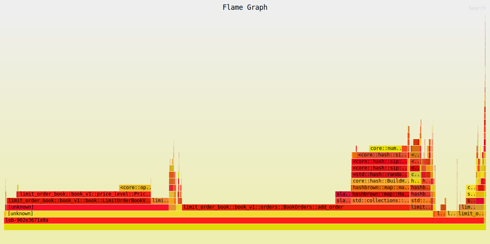

# Limit Order Book (v1)

| Property | Value |
|----------|-------|
| Timestamp | 2026-03-24T18:24:33Z |
| CPU | AMD Ryzen 7 7800X3D 8-Core Processor |
| Cores | 16 |
| Memory | 30.5 GB |
| OS | Linux Mint 22.3 (x86_64) |
| Host | mint |
| Rust | rustc 1.91.1 (ed61e7d7e 2025-11-07) |
| Clock | TSC (RDTSC via quanta) |
| ASLR | disabled (randomize_va_space=0) |
| CPU governor | performance (all 16 CPUs) |
| IRQ affinity (sample) | mixed (64 sampled IRQs; first=0-15) |
| Isolated CPUs | 2-3,10-11 |
| Swap | none active (/proc/swaps header only) |
| Turbo / boost | disabled (AMD cpufreq boost=0) |
| Baseline | "Limit Order Book (v0)" (2026-03-24T18:20:25Z) |

## Latency

| Property | Value |
|----------|-------|
| BENCH_ITERS | 100000 |
| Default pinned core | pin core 2 |
| WARMUP_ITERS | 10000 |
| book_levels | 100 |
| orders_per_level | 10 |

### Latency

| Operation | min | p50 | p90 | p95 | p99 | p99.9 | max | mean | stdev | allocs/op | deallocs/op | bytes/op |
|-----------|-----|-----|-----|-----|-----|-------|-----|------|-------|-----------|-------------|----------|
| Add (passive) | 30ns | 50ns | 60ns | 70ns | 80ns | 170ns | 390ns | 52ns | 10ns | 0.0 | 0.0 | 0B |
| Add (sweep 5 levels, 50 fills) | 791ns | 851ns | 891ns | 901ns | 921ns | 1.3μs | 1.8μs | 852ns | 33ns | 0.0 | 0.0 | 0B |
| Market (sweep 10 levels, 100 fills) | 1.5μs | 1.6μs | 1.7μs | 1.7μs | 1.7μs | 2.1μs | 5.3μs | 1.6μs | 40ns | 0.0 | 0.0 | 0B |
| Cancel (head of queue) | 30ns | 50ns | 60ns | 70ns | 70ns | 230ns | 531ns | 50ns | 11ns | 0.0 | 0.0 | 0B |
| Cancel (tail of queue) | 20ns | 50ns | 50ns | 60ns | 70ns | 260ns | 661ns | 46ns | 12ns | 0.0 | 0.0 | 0B |
| Spread (BBO query) | 1ns | 10ns | 10ns | 10ns | 10ns | 20ns | 200ns | 8ns | 4ns | 0.0 | 0.0 | 0B |
| Depth (top 5) | 120ns | 160ns | 180ns | 180ns | 200ns | 751ns | 1.5μs | 165ns | 31ns | 2.0 | 1.0 | 128B |
| Order lookup (hit) | 10ns | 10ns | 20ns | 20ns | 20ns | 50ns | 220ns | 13ns | 5ns | 0.0 | 0.0 | 0B |
| Realistic mix (per-op) | 1ns | 70ns | 90ns | 90ns | 100ns | 300ns | 801ns | 67ns | 21ns | 0.0 | 0.0 | 0B |

#### vs baseline

| Operation | p50 | p99 | p99.9 | mean | allocs/op | deallocs/op | bytes/op |
|-----------|-----|-----|-------|------|-----------|-------------|----------|
| Add (passive) | 50ns (=) | 80ns (↓11.1%) | 170ns (↑54.5%) | 52ns (↓4.2%) | 0.0 (↓100.0%) | 0.0 (=) | 0B (↓100.0%) |
| Add (sweep 5 levels, 50 fills) | 851ns (↓40.6%) | 921ns (↓41.4%) | 1.3μs (↓29.1%) | 852ns (↓40.7%) | 0.0 (=) | 0.0 (↓100.0%) | 0B (=) |
| Market (sweep 10 levels, 100 fills) | 1.6μs (↓43.0%) | 1.7μs (↓44.5%) | 2.1μs (↓36.6%) | 1.6μs (↓43.0%) | 0.0 (=) | 0.0 (↓100.0%) | 0B (=) |
| Cancel (head of queue) | 50ns (↑25.0%) | 70ns (=) | 230ns (↑43.8%) | 50ns (↑21.1%) | 0.0 (=) | 0.0 (=) | 0B (=) |
| Cancel (tail of queue) | 50ns (↓68.8%) | 70ns (↓58.8%) | 260ns (↑44.4%) | 46ns (↓70.9%) | 0.0 (=) | 0.0 (=) | 0B (=) |
| Spread (BBO query) | 10ns (=) | 10ns (=) | 20ns (=) | 8ns (↓5.1%) | 0.0 (=) | 0.0 (=) | 0B (=) |
| Depth (top 5) | 160ns (↑220.0%) | 200ns (↑233.3%) | 751ns (↑142.3%) | 165ns (↑200.1%) | 2.0 (↑100.0%) | 1.0 (=) | 128B (↑60.0%) |
| Order lookup (hit) | 10ns (↓66.7%) | 20ns (↓50.0%) | 50ns (↓64.3%) | 13ns (↓51.1%) | 0.0 (=) | 0.0 (=) | 0B (=) |
| Realistic mix (per-op) | 70ns (↑16.7%) | 100ns (↓9.1%) | 300ns (↑57.9%) | 67ns (↑8.0%) | 0.0 (↓100.0%) | 0.0 (=) | 0B (↓100.0%) |

## Throughput (realistic mix)

| Property | Value |
|----------|-------|
| Default pinned core | pin core 2 |
| book_levels | 100 |
| orders_per_level | 10 |

### Throughput

| Scenario | ops/sec | allocs/op | deallocs/op | bytes/op | setup allocs | setup bytes |
|----------|---------|-----------|-------------|----------|--------------|-------------|
| Throughput (realistic mix) | 44.3M | 0.0 | 0.0 | 0B | 3 | 1.9MiB |

#### vs baseline

| Operation | ops/sec | allocs/op | deallocs/op | bytes/op | setup allocs | setup bytes |
|-----------|---------|-----------|-------------|----------|--------------|-------------|
| Throughput (realistic mix) | 44.3M (↑130.1%) | 0.0 (↓100.0%) | 0.0 (↓100.0%) | 0B (↓100.0%) | 3.0 (↓99.5%) | 1.9MiB (↑298.5%) |

| Scenario | Accepted | Rejected | Fill | Filled | Cancelled |
|----------|----------|----------|------|--------|-----------|
| Throughput (realistic mix) | 116.0M | 0 | 32.0M | 40.0M | 76.0M |

##### Throughput flamegraph

