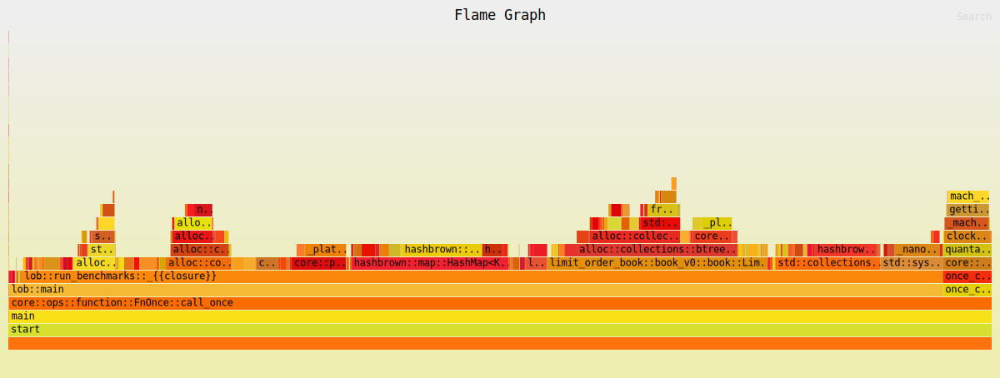

# Limit Order Book (v0) — Latency - Latency Report

| Property | Value |
|----------|-------|
| Timestamp | 2026-03-16T19:30:17Z |
| CPU | Apple M4 Pro |
| Cores | 12 |
| Memory | 24.0 GB |
| OS | Darwin 15.7.4 (aarch64) |
| Host | Mac.mynet |
| Rust | rustc 1.91.1 (ed61e7d7e 2025-11-07) |
| Clock | OS clock (platform fallback via quanta) |
| Samples | 100000 (warmup: 10000) |
| book_levels | 100 |
| crowded_level_orders | 500 |
| iters | 100000 |
| lob_version | v0 |
| orders_per_level | 10 |
| resting_orders | 2000 |

## Results

| Operation | min | p50 | p90 | p95 | p99 | p99.9 | max | mean | stdev | allocs/op | deallocs/op | bytes/op |
|-----------|-----|-----|-----|-----|-----|-------|-----|------|-------|-----------|-------------|----------|
| Add (passive) | 1ns | 42ns | 42ns | 83ns | 84ns | 125ns | 292ns | 35ns | 21ns | 1.0 | 0.0 | 32B |
| Add (sweep 5 levels, 50 fills) | 850ns | 1.1μs | 1.2μs | 1.2μs | 1.5μs | 5.4μs | 40.4μs | 1.1μs | 288ns | 0.0 | 6.0 | 0B |
| Market (sweep 10 levels, 100 fills) | 1.8μs | 2.2μs | 2.4μs | 2.5μs | 3.0μs | 7.0μs | 247.4μs | 2.2μs | 922ns | 0.0 | 14.0 | 0B |
| Cancel (head of queue) | 1ns | 42ns | 42ns | 42ns | 84ns | 458ns | 10.7μs | 34ns | 65ns | 0.0 | 0.0 | 0B |
| Cancel (tail of queue) | 100ns | 167ns | 208ns | 209ns | 209ns | 267ns | 40.3μs | 169ns | 160ns | 0.0 | 0.0 | 0B |
| Spread (BBO query) | 1ns | 1ns | 1ns | 41ns | 42ns | 42ns | 167ns | 3ns | 9ns | 0.0 | 0.0 | 0B |
| Depth (top 5) | 1ns | 42ns | 42ns | 42ns | 84ns | 417ns | 9.2ms | 136ns | 29.3μs | 1.0 | 1.0 | 80B |
| Order lookup (hit) | 1ns | 1ns | 1ns | 42ns | 42ns | 84ns | 4.4μs | 5ns | 18ns | 0.0 | 0.0 | 0B |
| Realistic mix (per-op) | 1ns | 42ns | 83ns | 84ns | 125ns | 333ns | 15.2μs | 45ns | 67ns | 0.4 | 0.0 | 13B |

### Throughput

| Scenario | ops/sec | allocs/op | deallocs/op | bytes/op | setup allocs | setup bytes |
|----------|---------|-----------|-------------|----------|--------------|-------------|
| Throughput (sustained mix) | 20644563 | 5.0 | 5.0 | 672B | 645 | 499.5KiB |

#### Throughput flamegraph

