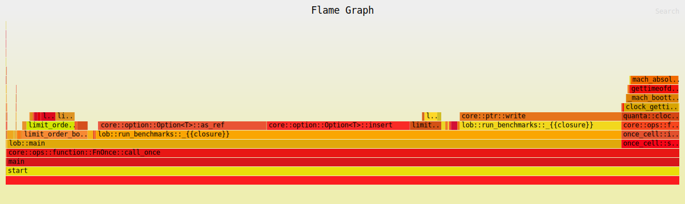

# Limit Order Book (v1) — Latency - Latency Report

| Property | Value |
|----------|-------|
| Timestamp | 2026-03-16T19:40:14Z |
| CPU | Apple M4 Pro |
| Cores | 12 |
| Memory | 24.0 GB |
| OS | Darwin 15.7.4 (aarch64) |
| Host | Mac.mynet |
| Rust | rustc 1.91.1 (ed61e7d7e 2025-11-07) |
| Clock | OS clock (platform fallback via quanta) |
| Samples | 100000 (warmup: 10000) |
| book_levels | 100 |
| crowded_level_orders | 500 |
| iters | 100000 |
| lob_version | v1 |
| orders_per_level | 10 |
| resting_orders | 2000 |

## Results

| Operation | min | p50 | p90 | p95 | p99 | p99.9 | max | mean | stdev | allocs/op | deallocs/op | bytes/op |
|-----------|-----|-----|-----|-----|-----|-------|-----|------|-------|-----------|-------------|----------|
| Add (passive) | 1ns | 1ns | 1ns | 42ns | 42ns | 42ns | 666ns | 4ns | 12ns | 0.0 | 0.0 | 0B |
| Add (sweep 5 levels, 50 fills) | 208ns | 333ns | 375ns | 375ns | 458ns | 541ns | 37.6μs | 320ns | 157ns | 0.0 | 0.0 | 0B |
| Market (sweep 10 levels, 100 fills) | 393ns | 583ns | 666ns | 684ns | 834ns | 1.4μs | 115.9μs | 595ns | 401ns | 0.0 | 0.0 | 0B |
| Cancel (head of queue) | 1ns | 1ns | 41ns | 42ns | 42ns | 42ns | 458ns | 5ns | 12ns | 0.0 | 0.0 | 0B |
| Cancel (tail of queue) | 1ns | 1ns | 41ns | 42ns | 42ns | 42ns | 459ns | 5ns | 13ns | 0.0 | 0.0 | 0B |
| Spread (BBO query) | 1ns | 1ns | 1ns | 1ns | 42ns | 42ns | 459ns | 2ns | 6ns | 0.0 | 0.0 | 0B |
| Depth (top 5) | 1ns | 42ns | 83ns | 83ns | 84ns | 166ns | 16.9μs | 46ns | 104ns | 2.0 | 1.0 | 128B |
| Order lookup (hit) | 1ns | 1ns | 1ns | 1ns | 41ns | 42ns | 250ns | 1ns | 4ns | 0.0 | 0.0 | 0B |
| Realistic mix (per-op) | 1ns | 1ns | 42ns | 42ns | 42ns | 167ns | 11.0μs | 21ns | 48ns | 0.0 | 0.0 | 0B |

### Throughput

| Scenario | ops/sec | allocs/op | deallocs/op | bytes/op | setup allocs | setup bytes |
|----------|---------|-----------|-------------|----------|--------------|-------------|
| Throughput (sustained mix) | 4047176 | 0.0 | 0.0 | 0B | 2 | 7706.6MiB |

#### Throughput flamegraph

## Comparison vs Baseline

| Property | Value |
|----------|-------|
| Baseline | "Limit Order Book (v0) — Latency" (2026-03-16T19:30:17Z) |
| Operation | p50 | p99 | p99.9 | mean | allocs/op | deallocs/op | bytes/op |
|-----------|-----|-----|-------|------|-----------|-------------|----------|
| Add (passive) | 1ns (↓97.6%) | 42ns (↓50.0%) | 42ns (↓66.4%) | 4ns (↓87.0%) | 0.0 (↓100.0%) | 0.0 (=) | 0B (↓100.0%) |
| Add (sweep 5 levels, 50 fills) | 333ns (↓69.3%) | 458ns (↓69.5%) | 541ns (↓89.9%) | 320ns (↓71.2%) | 0.0 (=) | 0.0 (↓100.0%) | 0B (=) |
| Market (sweep 10 levels, 100 fills) | 583ns (↓73.6%) | 834ns (↓71.8%) | 1.4μs (↓79.8%) | 595ns (↓73.4%) | 0.0 (=) | 0.0 (↓100.0%) | 0B (=) |
| Cancel (head of queue) | 1ns (↓97.6%) | 42ns (↓50.0%) | 42ns (↓90.8%) | 5ns (↓84.6%) | 0.0 (=) | 0.0 (=) | 0B (=) |
| Cancel (tail of queue) | 1ns (↓99.4%) | 42ns (↓79.9%) | 42ns (↓84.3%) | 5ns (↓96.5%) | 0.0 (=) | 0.0 (=) | 0B (=) |
| Spread (BBO query) | 1ns (=) | 42ns (=) | 42ns (=) | 2ns (↓36.1%) | 0.0 (=) | 0.0 (=) | 0B (=) |
| Depth (top 5) | 42ns (=) | 84ns (=) | 166ns (↓60.2%) | 46ns (↓66.3%) | 2.0 (↑100.0%) | 1.0 (=) | 128B (↑60.0%) |
| Order lookup (hit) | 1ns (=) | 41ns (↓2.4%) | 42ns (↓50.0%) | 1ns (↓68.9%) | 0.0 (=) | 0.0 (=) | 0B (=) |
| Realistic mix (per-op) | 1ns (↓97.6%) | 42ns (↓66.4%) | 167ns (↓49.8%) | 21ns (↓52.7%) | 0.0 (↓100.0%) | 0.0 (=) | 0B (↓100.0%) |

### Throughput

| Operation | ops/sec | allocs/op | deallocs/op | bytes/op | setup allocs | setup bytes |
|-----------|---------|-----------|-------------|----------|--------------|-------------|
| Throughput (sustained mix) | 4.0M (↓80.4%) | 0.0 (↓100.0%) | 0.0 (↓100.0%) | 0B (↓100.0%) | 2.0 (↓99.7%) | 7706.6MiB (↑1579829.5%) |

